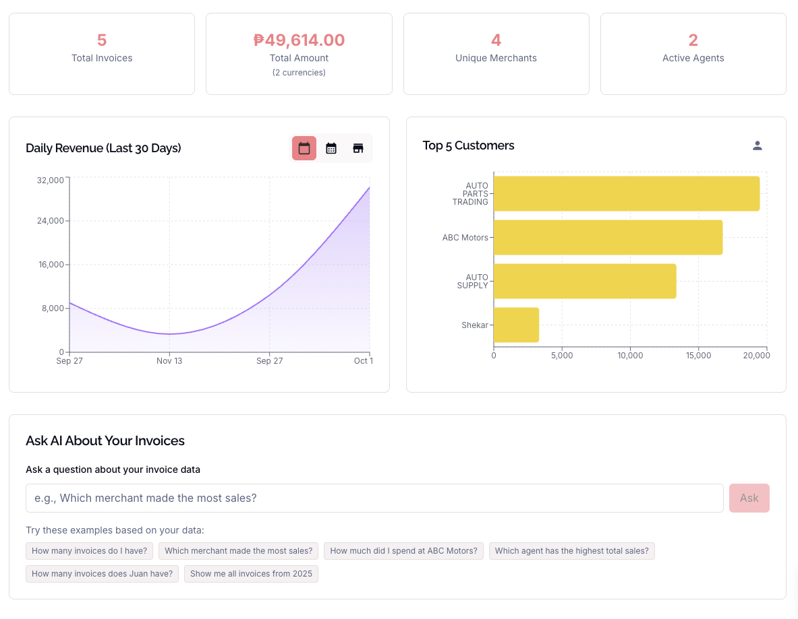
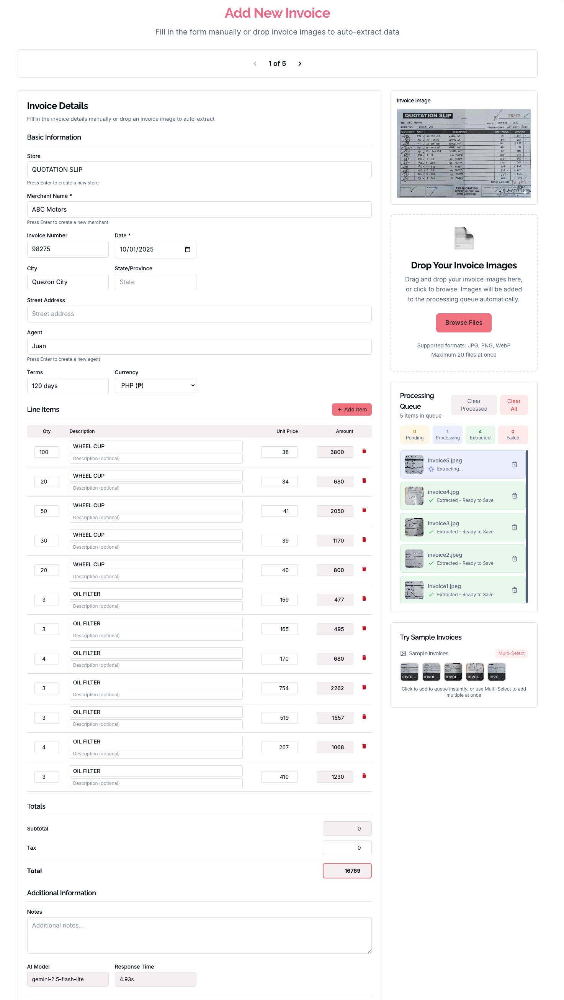
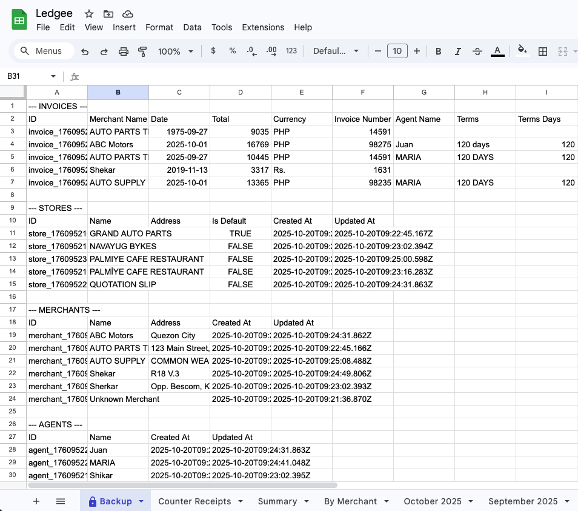

# Ledgee

Built-in AI invoice extraction for small businesses. Perfect for mom-and-pop shops! Extract invoice data instantly using Chrome's built-in AI, generate reports, and sync to Google Sheets.

## Screenshots

### Dashboard


### Add Invoice


### Google Sheets Integration


## Features

- **Built-in Chrome AI** - Uses Chrome's native LanguageModel API with Gemini Nano
- **Offline-First** - Works completely offline after initial load
- **Local Database** - Stores all data locally using SQLite WASM
- **Analytics & Reports** - Generate insights and export to Google Sheets
- **Responsive Design** - Works seamlessly on desktop and mobile
- **Privacy-Focused** - All processing happens locally in your browser
- **Smart Extraction** - Automatically extracts merchant, items, totals, dates

## Tech Stack

- **Next.js 14** - React framework with App Router
- **TypeScript** - Type-safe development
- **Tailwind CSS** - Utility-first styling
- **Chrome LanguageModel API** - Built-in Gemini Nano model
- **SQL.js** - SQLite database in WebAssembly
- **Google Sheets API** - Export and sync functionality

## Usage

1. **Setup Chrome**:
   - Enable these flags in Chrome:
     - `chrome://flags/#prompt-api-for-gemini-nano`
     - `chrome://flags/#optimization-guide-on-device-model`
     - `chrome://flags/#enable-experimental-web-platform-features`
   - Set all to "Enabled" and restart Chrome
   - Visit `chrome://components/` and update "Optimization Guide On Device Model"

2. **Install & Run**:
   ```bash
   git clone https://github.com/papayaah/ledgee
   cd ledgee
   npm install
   npm run dev
   ```

3. **Extract Invoices**:
   - Drag and drop invoice images
   - Review extracted data
   - Generate reports and sync to Google Sheets

## Browser Compatibility

- Chrome (with LanguageModel flags enabled)
- Other browsers not supported yet

## Support

- **Website**: [https://www.ledgee.app](https://www.ledgee.app)
- **Support**: [https://strostudio.com](https://strostudio.com)
- **GitHub**: [https://github.com/papayaah/ledgee](https://github.com/papayaah/ledgee)

---

Built with love by [Stro Studio](https://strostudio.com) - Small apps, big heart.